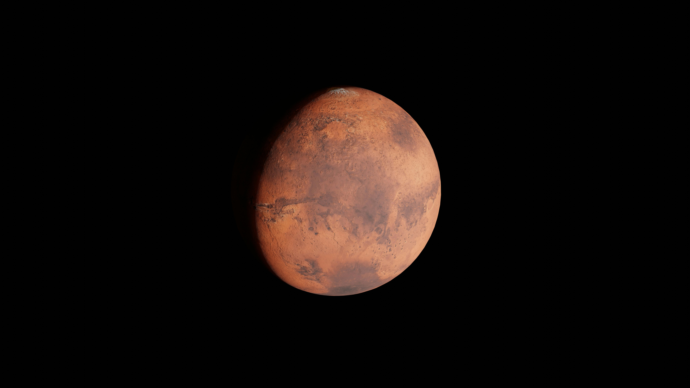

<!DOCTYPE html>

<html lang="en">
<head>

  <meta charset="UTF-8">
  <title>ZenithX</title>

  <!-- Favicon -->
      
  <link rel="icon" type="image/png" href="hlogo.png">

  <!-- Bootstrap CSS -->

  <link href="https://cdn.jsdelivr.net/npm/bootstrap@5.3.3/dist/css/bootstrap.min.css" rel="stylesheet">

  <!--IntroCSS-->

  

</head>

<body>

<!-- NAVBAR -->

<nav class="navbar navbar-expand-lg navbar-dark bg-dark">
  

<!-- Logo -->

<!-- TOGGLER (IMPORTANT for mobile) -->

<button class="navbar-toggler" type="button" data-bs-toggle="collapse" data-bs-target="#navbarSupportedContent">
  
</button>

<!-- NAV ITEMS -->

  <ul class="navbar-nav me-auto mb-2 mb-lg-0">

    <!-- Home -->
    
  <li class="nav-item">
      <a class="nav-link active" href="index.html">Home</a>
    </li>

    <!-- About -->
    
  <li class="nav-item">
      <a class="nav-link" href="#">About Us</a>
    </li>

    <!-- Launching Vehicles -->
    
  <li class="nav-item dropdown">
      <a class="nav-link dropdown-toggle" href="#" data-bs-toggle="dropdown">
        Launching Vehicles
      </a>
      <ul class="dropdown-menu">
        <li><a class="dropdown-item" href="#">Falcon</a></li>
        <li><a class="dropdown-item" href="#">EVORA</a></li>
        <li><a class="dropdown-item" href="#">Shuttler</a></li>
      </ul>
    </li>

    <!-- Brand -->
    
  <li class="nav-item dropdown">
      <a class="nav-link dropdown-toggle" href="#" data-bs-toggle="dropdown">
        Brand
      </a>
      <ul class="dropdown-menu">
        <li><a class="dropdown-item" href="#">Updates</a></li>
        <li><a class="dropdown-item" href="#">Missions Done</a></li>
        <li>
</li>
        <li><a class="dropdown-item" href="#">Career</a></li>
      </ul>
    </li>

    <!-- Shop -->
    
  <li class="nav-item dropdown">
      <a class="nav-link dropdown-toggle" href="#" data-bs-toggle="dropdown">
        Shop
      </a>
      <ul class="dropdown-menu text-center">
        <li>
Buy mockups of:
</li>
        <li>
</li>
        <li><a class="dropdown-item" href="#">Gyan AI</a></li>
        <li><a class="dropdown-item" href="#">ZenithX</a></li>
      </ul>
    </li>

    <!--Gyan Ai-->

  <li class="nav-item">
      <a class="nav-link" href="">Gyan AI</a>
    </li>

    <!-- Login -->
    
  <li class="nav-item">
      <a class="nav-link" href="#">Login</a>
    </li>

    <!-- Register -->
    
  <li class="nav-item">
      <a class="nav-link" href="#">Register</a>
    </li>

  </ul>

<!-- RIGHT SIDE NAV -->

<ul class="navbar-nav ms-auto">

  <li class="nav-item dropdown">
    <a class="nav-link dropdown-toggle" href="#" data-bs-toggle="dropdown">
      Upcoming Missions
    </a>

  <ul class="dropdown-menu dropdown-menu-end">

    
      <!-- Mars -->
  <li>
    <a class="dropdown-item d-flex align-items-center" href="mars.html">
          
          Mars Mission
        </a>
      </li>

      <!-- Moon -->
      
  <li>
        <a class="dropdown-item d-flex align-items-center" href="moon.html">
          
          Moon Mission
        </a>
      </li>

  </ul>
  </li>

</ul>

  

</nav>

<!-- HERO SECTION -->

<section class="text-center text-white"
  style="background: linear-gradient(rgba(0,0,0,0.6), rgba(0,0,0,0.6)), url('space-bg.jpg') no-repeat center center/cover;
        height: 100vh;
        display: flex;
        align-items: center;
      justify-content: center;">

  <!-- Content -->
  
  

    

  <!-- LEFT TEXT -->
  
  

    <h1 class="display-3 fw-bold">ZenithX</h1>
    
The future is more exciting when we explore beyond Horizon

  <a href="#" class="btn btn-light me-2">Explore</a>
  <a href="#" class="btn btn-outline-light">Join</a>
  

  <!-- RIGHT EARTH -->
  
  

    
  

  

  

</section>

<!--To differentiate section-->

<h2 class="text-center text-white mt-5">Our Rockets</h2>

<!--Carrousel-->

  <!-- Indicators -->
  

    <button type="button" data-bs-target="#rocketCarousel" data-bs-slide-to="0" class="active"></button>
    <button type="button" data-bs-target="#rocketCarousel" data-bs-slide-to="1"></button>
    <button type="button" data-bs-target="#rocketCarousel" data-bs-slide-to="2"></button>
  

  <!-- Images -->
  

  

      
      

    <h3>Falcon</h3>
  
Reusable heavy-lift rocket designed for Mars missions

  

    

  

      

  

    <h3>EVORA</h3>
  
Reusable light-lift rocket designed for Moon missions

  

  

  

      

  

    <h3>Shuttler</h3>
    
Reusable light-lift rocket designed for satellite missions

  

    

  

  <!-- Controls -->
  
  <button class="carousel-control-prev" type="button" data-bs-target="#rocketCarousel" data-bs-slide="prev">
    
  </button>

  <button class="carousel-control-next" type="button" data-bs-target="#rocketCarousel" data-bs-slide="next">
    
  </button>

<!--To differentiate section-->

   

  <!--Call to action-->

  

    <h2>Join the Future of Space Exploration</h2>
    
Be part of the next generation of innovators.

    <a href="#" class="btn btn-light mt-3">Get Started</a>
  

<!--To differentiate section-->

<!--Footer-->

<footer class="text-center text-white py-3 bg-dark">
  
© 2026 ZenithX | All Rights Reserved

</footer>

<!-- Bootstrap JS -->

</body>
-</html>
